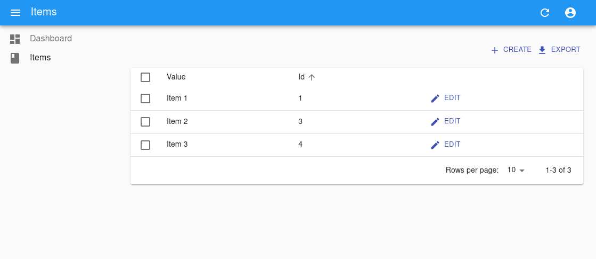

# FastAPI-Starter

A FastAPI based starter that relies heavily on existing plugins/frameworks. Integrates with OpenAPI Generator for a Typescript client, FastAPI Users for authentication, async-first with SQLAlchemy 2.0.

---

## Features

- Uses **best practices**: Factory pattern and environment variables for configuration
- User registration, models, authentication using [**FastAPI Users**](https://github.com/fastapi-users/fastapi-users)
- Modern admin interface using [**React-Admin**](https://marmelab.com/react-admin/)
- **Github Action** for building docker images and running automated tests
- **Dependabot** config to keep project dependencies up to date
- Create Typescript bindings for front-end automatically from OpenAPI spec using [**OpenAPI-Generator**](https://github.com/OpenAPITools/openapi-generator/), no need to write/update code when backend changes
- Async-first codebase with **SQLAlchemy 2.0** and Alembic for database migrations
- **pytest** with example tests included
- Integration tests with **Cypress**
- Docker images for frontend and backend
- Includes extra Dockerfile (backend serves frontend) for straightforward production deployment
- Pre-commit hooks with [Black](https://github.com/psf/black), [autoflake](https://github.com/PyCQA/autoflake), [isort](https://github.com/pycqa/isort), [flake8](https://github.com/PyCQA/flake8), [prettier](https://github.com/prettier/prettier), [eslint](https://github.com/eslint/eslint) for consistent code standards


## How to use

You need Python 3 and pip installed locally. Run the [cookiecutter](https://cookiecutter.readthedocs.io) command (at least 1.7) and you'll be asked a few prompts.

```bash
pip3 install cookiecutter
cookiecutter https://github.com/gaganpreet/fastapi-starter
```

### Input variables

The generator (cookiecutter) will ask you for some data, you might want to have at hand before generating the project.

The input variables, with their default values [default value], are:

* `project_name`: The name of the project
* `project_slug`: The development-friendly name of the project. By default, based on the project name.
* `backend_port`: The backend port on the localhost.
* `front_end_port`: The frontend port on the localhost.


If you want to keep up to date with upstream changes (i.e. changes in this template), then it's better to use [Cruft](https://cruft.github.io/cruft/), which is fully compatible with Cookiecutter.

```bash
pip3 install cruft
cruft create https://github.com/gaganpreet/fastapi-starter
```

Using cruft will generate a metadata file named `.cruft.json` (don't delete it). Later on you can update to the current version of this cookiecutter and import the changes to your generated project by running this command:

```bash
cruft update
```

## Objectives

- Sane defaults with few prompts
- Secure
- KISS principle

## Preview

#### View [live demo](https://demo-project-fastapi-starter.fly.dev) here.





[](#contributors)

## Contributors

<!-- ALL-CONTRIBUTORS-LIST:START - Do not remove or modify this section -->
<!-- prettier-ignore-start -->
<!-- markdownlint-disable -->

<!-- markdownlint-restore -->
<!-- prettier-ignore-end -->

<!-- ALL-CONTRIBUTORS-LIST:END -->


## Features not included

The following features were left out in favour of simplicity:

- Celery/Flower/Redis - Not needed for simple projects, Celery can be easily replaced with [background tasks](https://fastapi.tiangolo.com/tutorial/background-tasks/).
- Traefik configuration - I prefer [NGINX Proxy automation](https://github.com/evertramos/nginx-proxy-automation)

### Things to do

- [ ] Migrate to Ruff
- [ ] Email templates
